# Hermes CyberUI

A cyberpunk-themed web interface for the Hermes Agent framework. Built with React + FastAPI, styled with a custom neon-dark aesthetic.

## Features

- **Conversations** — Chat with Hermes in real-time via the web UI. Send messages, stream responses, and view conversation history grouped by platform (Telegram, Discord, CLI, API/Web).
- **Tasks (Kanban)** — Create, manage, and execute tasks on a drag-and-drop Kanban board with backlog, in-progress, done, and failed columns.
- **Sessions** — Browse, search, and resume conversational sessions with an AI agent. Each session tracks platform origin (CLI, Telegram, Discord, etc.).
- **Multi-Agent** — Configure and orchestrate multiple autonomous AI agents across different Discord channels (orchestrator, ideas, research, etc.).
- **Dashboard** — Real-time system stats: CPU, memory, disk usage, session counts, recent activity, and network access URLs.
- **Settings** — Theme customization (8 cyberpunk color schemes), visual effects toggle, model/provider configuration, and gateway management.
- **Skills** — Explore and manage the Hermes skill library with full-text search.
- **Cron Jobs** — Schedule automated tasks with Telegram/Discord delivery.
- **Memory** — Browse and search the agent's persistent memory across sessions.
- **Logs** — Live log streaming with pattern matching.
- **Files** — Browse and manage files in the Hermes workspace.
- **Config** — View and edit Hermes configuration files.

## Tech Stack

| Layer | Technology |
|-------|-----------|
| Frontend | React 18, TypeScript, Vite, TanStack Query |
| Styling | Custom cyberpunk CSS (CSS variables, neon glows, scanlines) |
| Backend | FastAPI (Python 3.9+) |
| Framework | Hermes Agent |
| Icons | Lucide React |

## Screenshots

The UI features a dark neon aesthetic with 8 color schemes (Matrix Green, Cyber Blue, Amber, Blood, Sunset, and more). All screenshots use the default Matrix theme with demo data — no real session content or personal information is shown.

| | | |
|:---:|:---:|:---:|
| 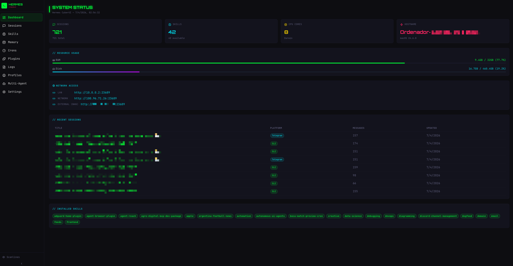 | 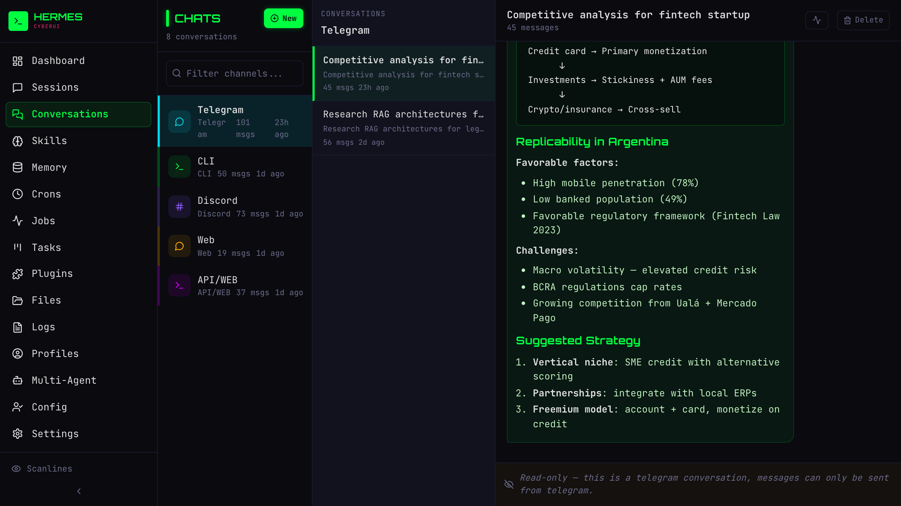 | 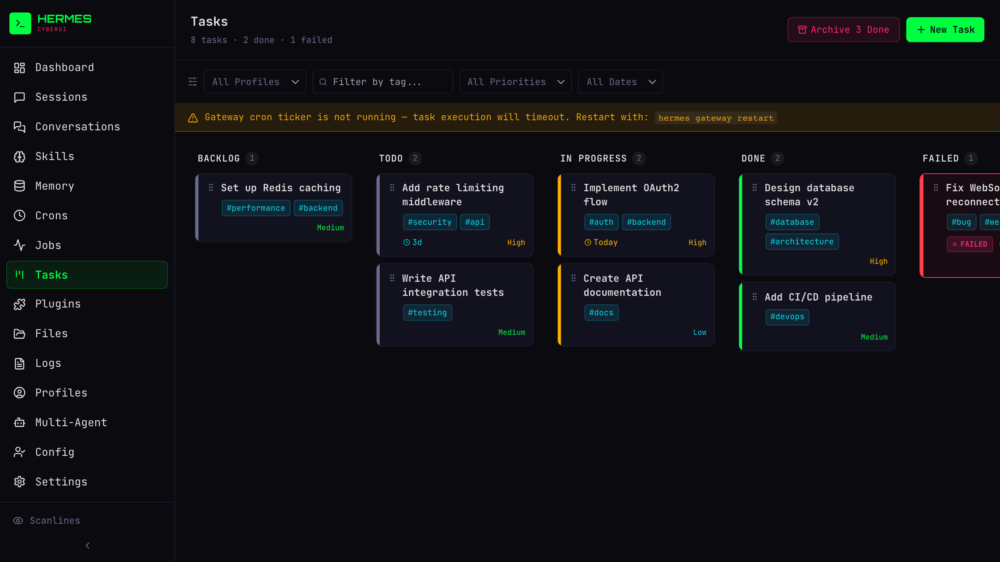 |
| **Dashboard** | **Conversations** | **Tasks** |
| 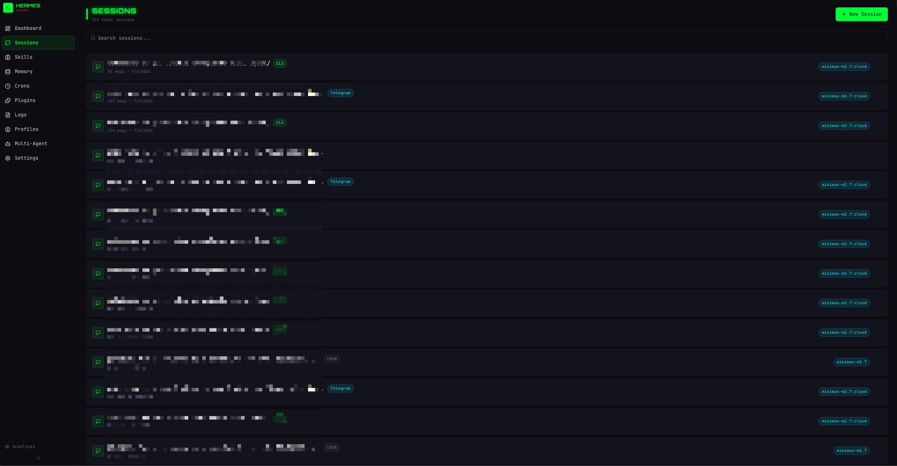 | 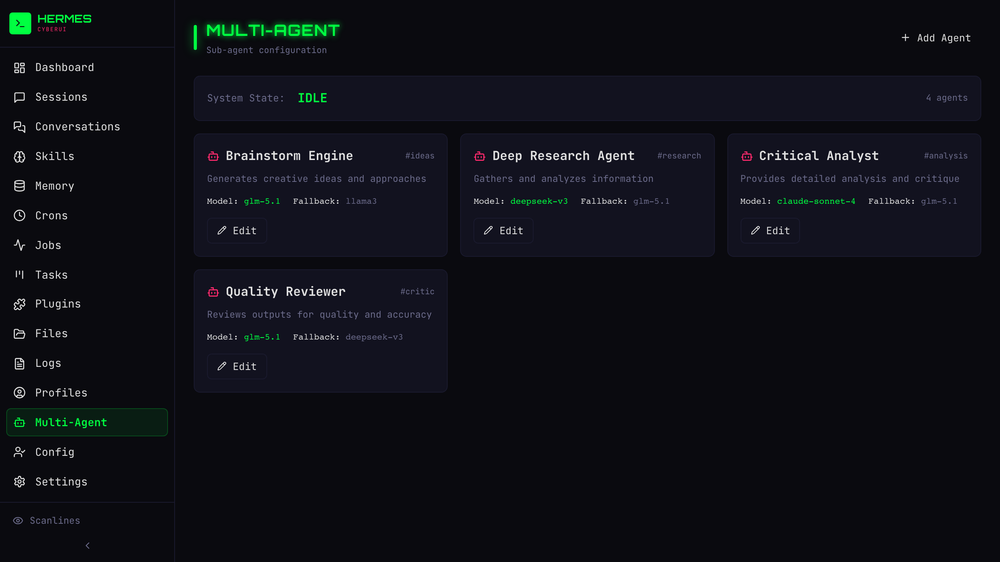 | 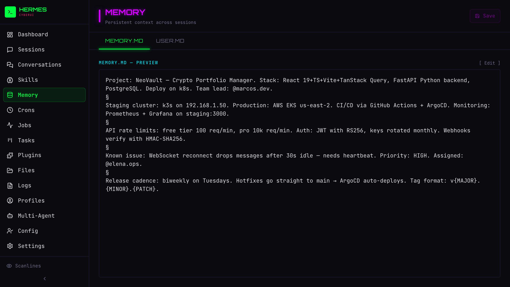 |
| **Sessions** | **Multi-Agent** | **Memory** |
| 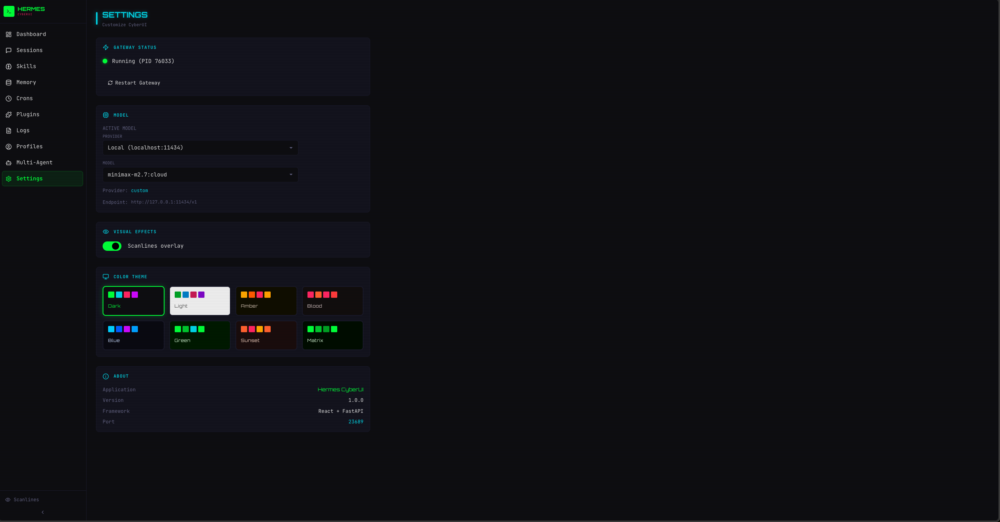 | 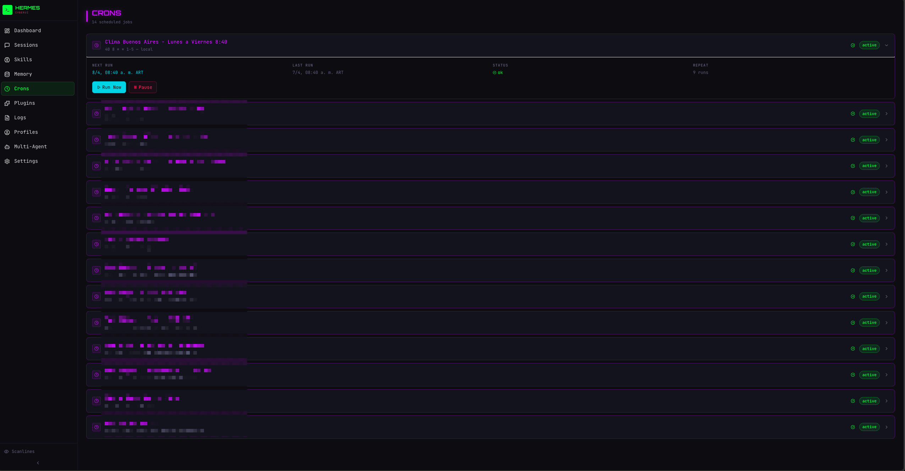 | 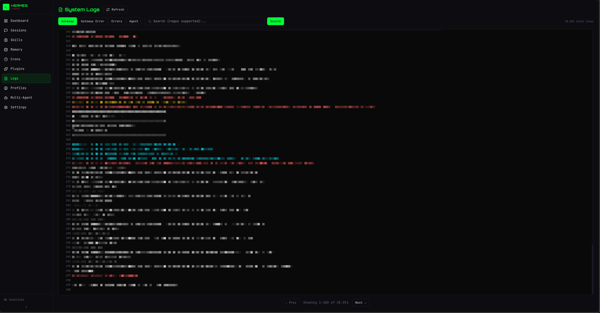 |
| **Settings** | **Cron Jobs** | **Logs** |
| 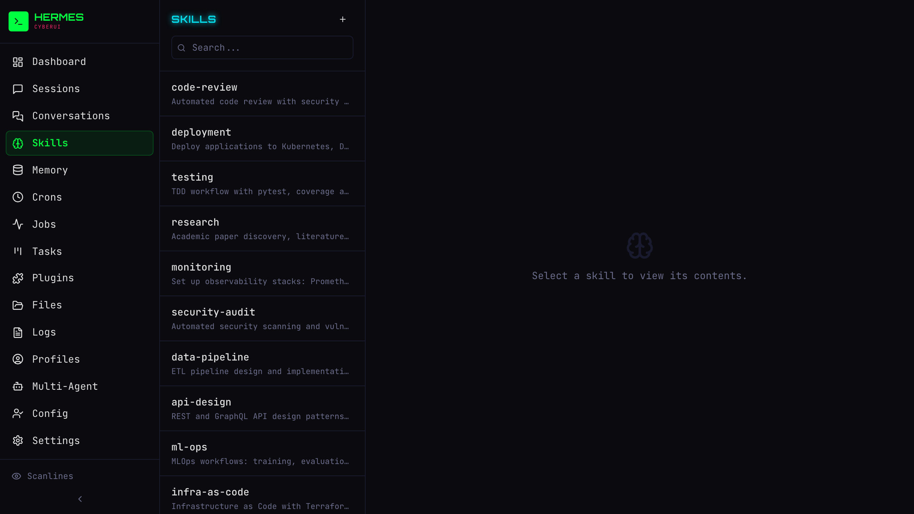 | 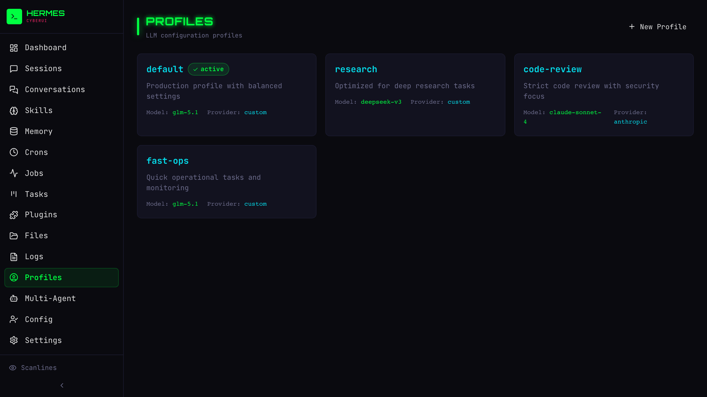 | 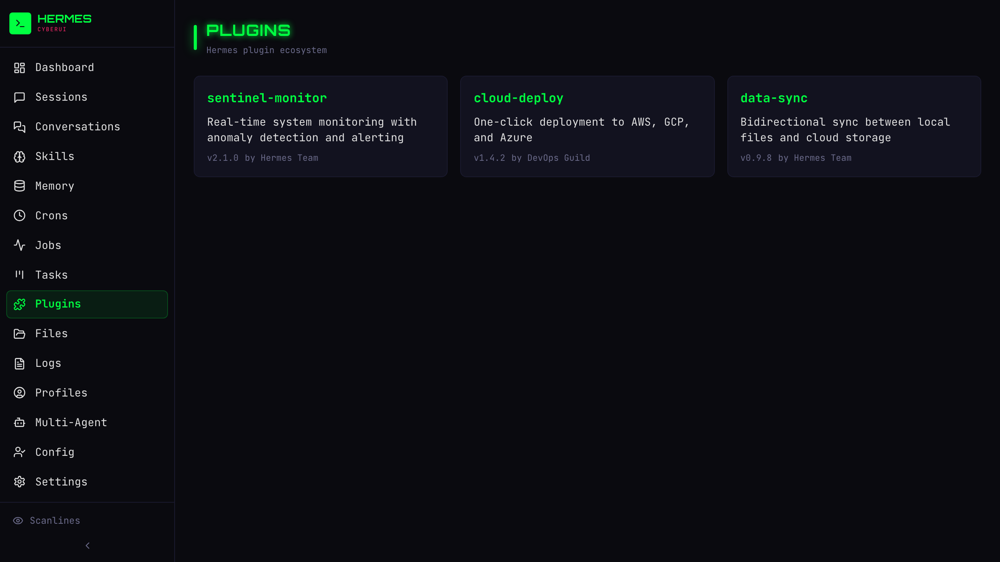 |
| **Skills** | **Profiles** | **Plugins** |
| 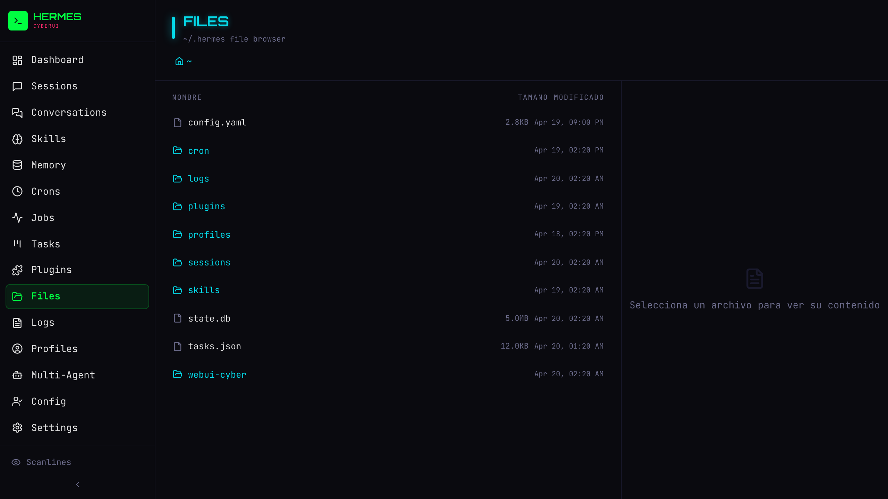 | 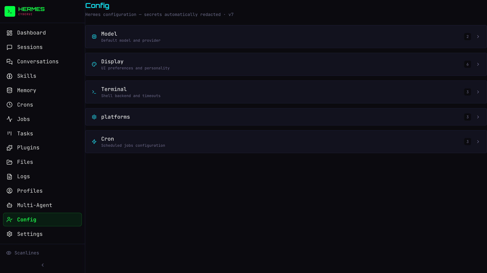 | 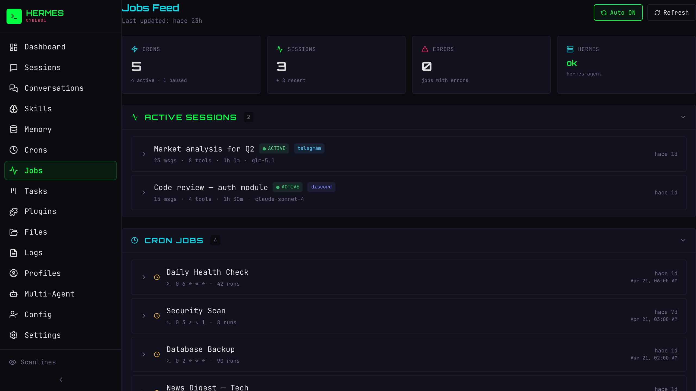 |
| **Files** | **Config** | **Jobs** |
| 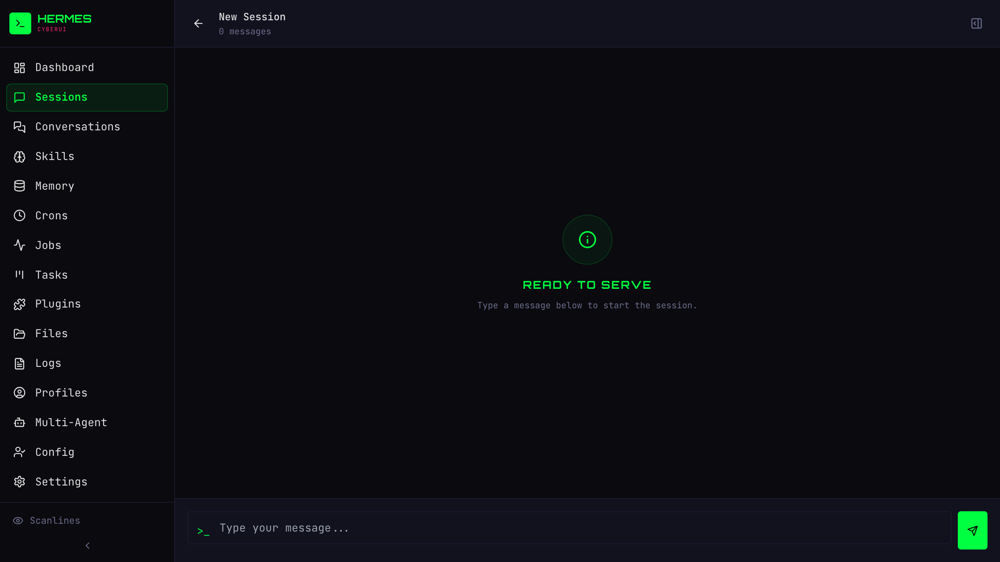 | 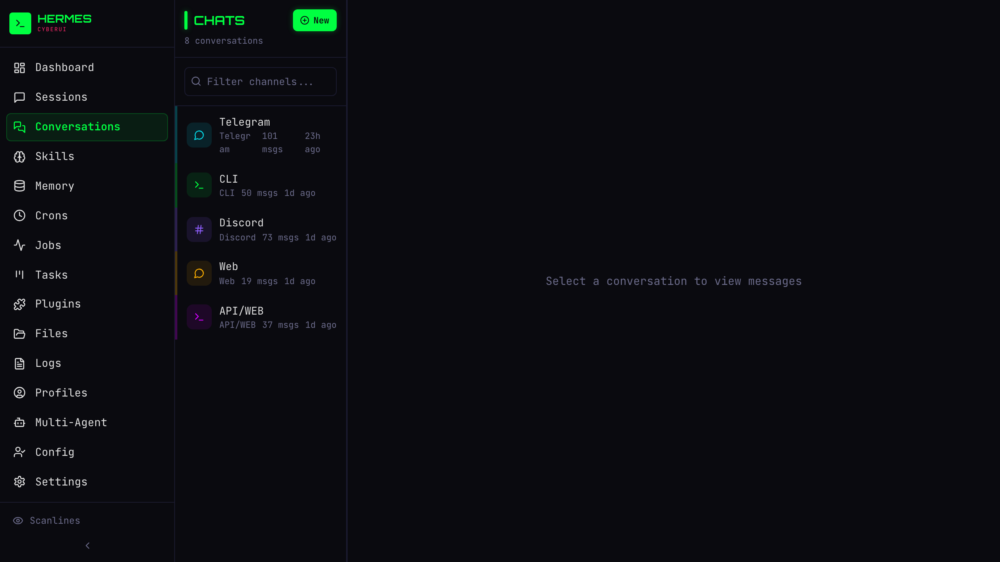 | |
| **Chat** | **Conversations** | |

## Architecture

```
webui-cyber/
  backend/
    main.py          # FastAPI app, CORS, StaticFiles
    routers/         # API routes (sessions, skills, crons, system...)
  frontend/
    src/
      pages/         # Chat, Sessions, Dashboard, Settings, Multiagent...
      lib/api.ts     # Axios-based API client
      styles/cyber.css  # Cyberpunk CSS with custom properties
```

Backend runs on port **23689**. The frontend is built into `dist/` and served by FastAPI at `/`.

## Quick Start

**No configuration needed** — CyberUI reads everything from your existing Hermes installation (`~/.hermes/`). API keys, tokens, and provider settings are picked up automatically from Hermes' config.

```bash
cd backend
pip install -r requirements.txt
./start.sh   # or: uvicorn main:app --reload --port 23689

cd ../frontend
npm install
npm run build
```

Access at: **http://localhost:23689**

See [INSTALL.md](./INSTALL.md) for full installation instructions.
